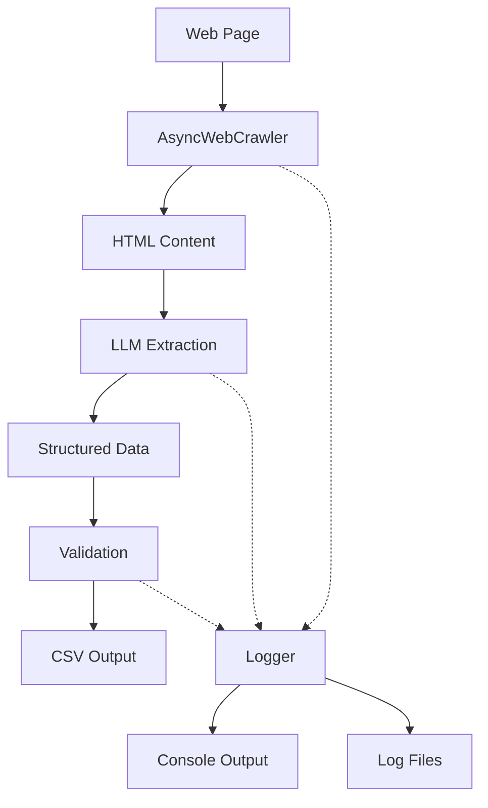

# DeepSeek AI Web Crawler

A robust web crawler using DeepSeek AI for extracting structured data from websites, with comprehensive error logging and validation.

## Architecture



## Error Logging System

The project implements a comprehensive logging system crucial for LLM-based web scraping. Due to the inherent unpredictability of LLM responses and the brittle nature of web scraping, extensive error logging is essential.

### Key Logging Features

1. **Unique Error Tracking**
   - Each error gets a unique ID with timestamp
   - Errors can be traced across the entire scraping process
   - Related errors are linked for debugging

2. **Structured Log Format**
   ```
   [TIMESTAMP] [LEVEL] [COMPONENT] Message
   =====================================
   Error ID: YYYYMMDD_HHMMSS_uniqueid
   Error: Detailed error message
   Traceback:
     Stack trace with proper indentation
   =====================================
   ```

3. **Log Rotation**
   - Daily log files with date stamps
   - 10MB size limit per file
   - Keeps last 5 rotated files
   - UTF-8 encoding for international text

4. **Contextual Logging**
   - Operation context (FETCH, PARSE, VALIDATE)
   - Performance metrics (timing, counts)
   - Data samples for debugging
   - Success/failure statistics

### Why Extensive Logging is Critical

1. **LLM Unpredictability**
   - LLM responses can vary significantly
   - Need to track extraction patterns
   - Identify common failure modes
   - Tune prompts based on failures

2. **Web Scraping Challenges**
   - Sites change structure frequently
   - Network issues are common
   - Rate limiting needs monitoring
   - CSS selectors can break

3. **Data Validation**
   - Track missing required fields
   - Monitor data quality
   - Identify pattern mismatches
   - Catch schema violations

4. **Performance Optimization**
   - Track timing per operation
   - Monitor resource usage
   - Identify bottlenecks
   - Guide optimization efforts

## Important Note on Web Scraping

Web scraping is inherently brittle, even with advanced LLM capabilities. Common challenges include:

- Website structure changes
- Dynamic content loading
- Anti-bot measures
- Rate limiting
- Network instability
- Character encoding issues
- International text handling

The logging system helps identify and debug these issues quickly, but regular maintenance and updates will still be necessary.

## Usage

1. Install dependencies:
   ```bash
   pip install -r requirements.txt
   ```

2. Set up environment variables:
   ```bash
   cp .env.example .env
   # Edit .env with your API keys
   ```

3. Run the crawler:
   ```bash
   python main.py
   ```

4. Monitor logs:
   - Check console for real-time updates
   - Review logs/crawler_YYYY-MM-DD.log for details
   - Use error IDs to track specific issues

## Log File Location

Logs are stored in the `logs` directory:
- Daily files: `logs/crawler_YYYY-MM-DD.log`
- Rotated files: `logs/crawler_YYYY-MM-DD.log.1`, `.2`, etc.
- Debug logs include raw content samples
- Error logs include full stack traces

## Best Practices

1. **Monitor Logs Regularly**
   - Check for recurring errors
   - Look for pattern changes
   - Monitor success rates
   - Track performance metrics

2. **Update Selectors and Prompts**
   - Use log data to refine CSS selectors
   - Adjust LLM prompts based on failures
   - Update validation rules as needed
   - Monitor site structure changes

3. **Performance Tuning**
   - Use timing data to optimize
   - Adjust batch sizes if needed
   - Fine-tune retry strategies
   - Balance speed vs. reliability

4. **Error Response**
   - Use error IDs for tracking
   - Check related errors
   - Review context data
   - Update code based on patterns

Remember: The key to successful LLM-based scraping is not just writing good extraction code, but having comprehensive logging to understand and respond to failures quickly.
